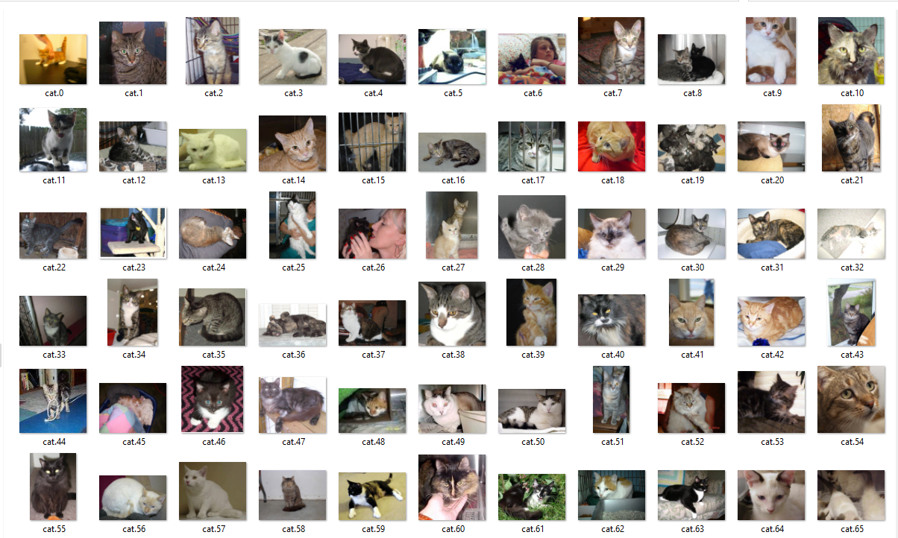
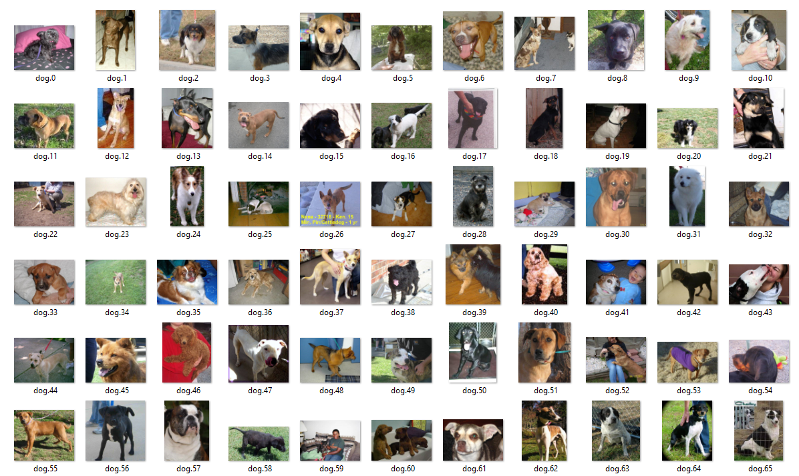
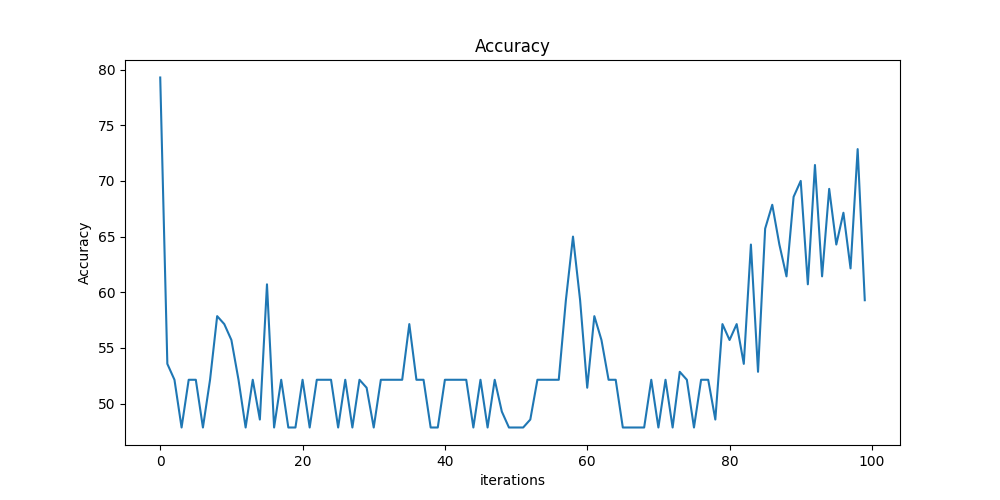
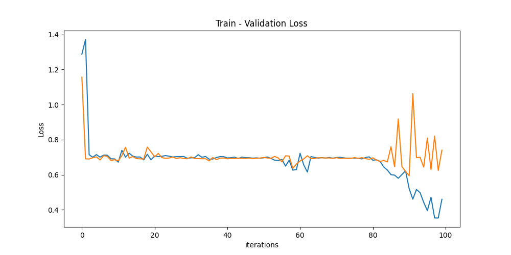
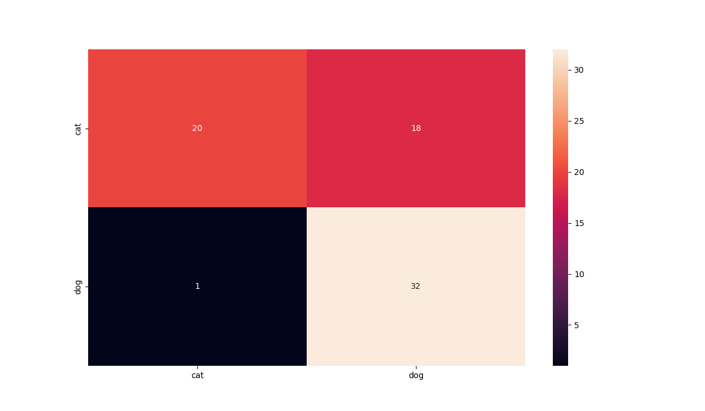

# Dogs vs Cats 

Image classification with the dataset from [cats vs dogs by kaggle](https://www.kaggle.com/c/dogs-vs-cats) with PyTorch

### 1.1 Description of dataset
Original dataset contains 25,000 images of dogs and cats.\
In this repo I deleted some of the images to make train faster.

### 1.2 Sample Data
Cats:\


Dogs:


### 1.3 Software and Packages
Necessary libraries can be found in ``requirements.txt`` file and can be install with the given command below:

`pip install -r requirements.txt`

### 2.1 Train and Run Model
Used GoogleNet pretrained model to train the model. [GoogleNet paper](https://arxiv.org/abs/1409.4842)\
Creating custom dataset in``custom_dataset.py`` and splitting train-test-validation dataset with given ratio 
in ``train.py`` file.

Train the model with GoogleNet, validate on validation data, and test on the test data.

Train model and run the program:

```python train.py```

Train accuracy


Train-Val loss


Classification Matrix

